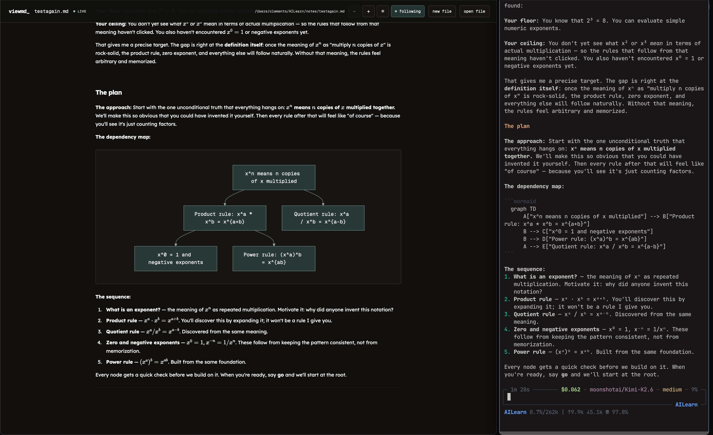

# pi-config



My pi configuration for AI learning sessions: a teaching skill, graded
quizzes, question popups, session-to-Markdown logging, and visualization
subagents.

## Install

```bash
# into the current directory as the learning project:
curl -fsSL https://raw.githubusercontent.com/pr0xy22/pi-config/main/install.sh | bash

# or into a specific project:
curl -fsSL https://raw.githubusercontent.com/pr0xy22/pi-config/main/install.sh | bash -s -- /path/to/project

# or locally:
git clone https://github.com/pr0xy22/pi-config && cd pi-config && ./install.sh /path/to/project
```

Requires [pi](https://github.com/earendil-works/pi).

## How to Learn with ViewMD (Highly Recommend)


1. Go to your learning folder and run the installation script described above.
2. Open ViewMD and create a new Markdown (.md) file.
3. Open Pi from your learning folder.
4. In Pi, enter /md-log /path/to/file. This connects the current session to the Markdown file and begins writing your session notes to it.
5. To begin a lesson, enter /teach <topic you want to learn>.

ViewMD provides a clean, readable front end for following your AI learning session. However, the feature that makes this system special is /teach.

The /teach method first determines what you already understand, creates a learning path from your current knowledge to your goal, and then teaches one reasoning step at a time. Each step ends with a short quiz, and the lesson advances only after you demonstrate that you understand the material.

[ViewMD](https://github.com/pr0xy22/ViewMD)

## What's in it

- `project/` — becomes `.pi/` in your learning project:
  - `extensions/quiz.ts` — graded questions with instant feedback (✓/✗, correct answer, explanation)
  - `extensions/ask-user-question.ts` — question popups
  - `extensions/md-log.ts` — mirror the session to a Markdown file (`/md-log <file>`), with machine-readable `qa-result` payloads for viewers
  - `extensions/visual-tools/` — tools for the visualization subagents
  - `skills/teach/`, `skills/visualize/` — the teaching method and lesson diagrams
  - `agents/` — `researcher`, `svg-maker`, `mermaid-maker`
- `global/` — installed to `~/.pi/agent/`: the permission system, `prev`, and the `learn-profile` skill
- `shared-skills/` — installed to `~/.agents/skills/`: `probe`, `learn-verify`, `learn-visual`, `teach` (with references), `learn-profile`
- `agent/settings.example.json` — the npm packages the full setup uses (`pi-subagents`, `pi-web-search`, themes, etc.). Merged only if you have no existing settings.

## Notes

- The subagent features (researcher, visual makers) need a subagent
  implementation — `pi-subagents` is in the example packages list. Without
  it, teaching works; verification and generated visuals don't.
- Derived from [amosblomqvist/learn](https://github.com/amosblomqvist/learn),
  heavily modified. See that repo for the original.
